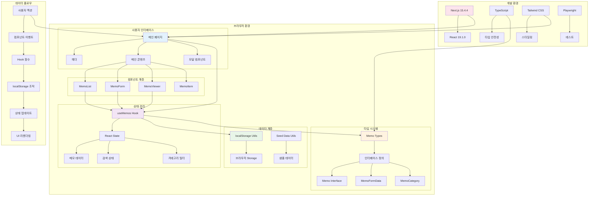

# 메모 앱 시스템 아키텍처

## 개요

이 다이어그램은 Next.js 기반 메모 앱의 전체 시스템 아키텍처를 보여줍니다. 클라이언트 사이드 렌더링과 로컬 스토리지를 활용한 단일 페이지 애플리케이션의 구조를 나타냅니다.

## 다이어그램

## 설명

### 1. 사용자 인터페이스 계층
- **메인 페이지**: 앱의 진입점으로 헤더, 메인 콘텐츠, 모달을 포함
- **헤더**: 앱 제목과 새 메모 생성 버튼
- **메인 콘텐츠**: 메모 목록과 검색/필터 기능
- **모달 컴포넌트**: 메모 생성/편집 폼과 상세 보기

### 2. 컴포넌트 계층
- **MemoList**: 메모 목록 표시 및 검색/필터 기능
- **MemoForm**: 메모 생성/편집 폼
- **MemoViewer**: 메모 상세 보기
- **MemoItem**: 개별 메모 아이템

### 3. 상태 관리
- **useMemos Hook**: 메모 데이터의 CRUD 작업과 상태 관리
- **React State**: 메모 목록, 검색 쿼리, 카테고리 필터 상태
- **로컬 상태**: 폼 열림/닫힘, 편집 중인 메모, 보기 중인 메모

### 4. 데이터 계층
- **localStorage Utils**: 브라우저 로컬 스토리지와의 상호작용
- **Seed Data Utils**: 초기 샘플 데이터 제공
- **데이터 지속성**: 브라우저 세션 간 데이터 유지

### 5. 타입 시스템
- **Memo Interface**: 메모 데이터 구조 정의
- **MemoFormData**: 폼 데이터 타입
- **MemoCategory**: 카테고리 열거형

### 6. 개발 환경
- **Next.js**: React 프레임워크
- **TypeScript**: 타입 안전성 제공
- **Tailwind CSS**: 유틸리티 기반 스타일링
- **Playwright**: E2E 테스트

## 데이터 플로우

1. **사용자 액션**: 버튼 클릭, 폼 제출 등
2. **컴포넌트 이벤트**: 이벤트 핸들러 호출
3. **Hook 함수**: useMemos의 CRUD 함수 실행
4. **localStorage 조작**: 데이터 저장/조회/수정/삭제
5. **상태 업데이트**: React 상태 변경
6. **UI 리렌더링**: 변경된 상태에 따른 화면 업데이트

## 참고사항

- **클라이언트 사이드 렌더링**: 모든 로직이 브라우저에서 실행
- **로컬 스토리지**: 서버 없이 데이터 지속성 제공
- **타입 안전성**: TypeScript로 런타임 오류 방지
- **반응형 디자인**: Tailwind CSS로 모바일 친화적 UI
- **테스트 가능성**: Playwright로 E2E 테스트 지원 